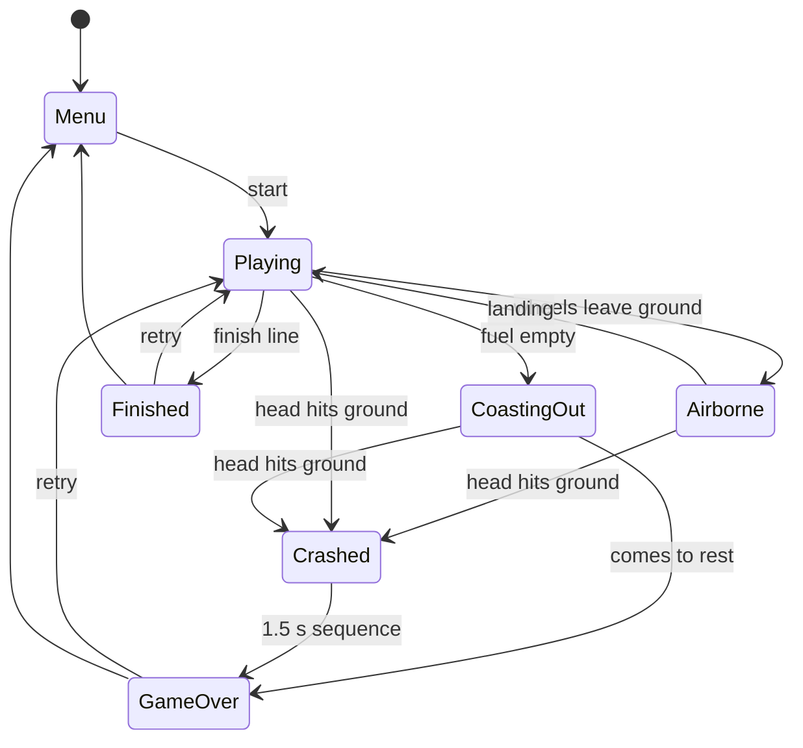
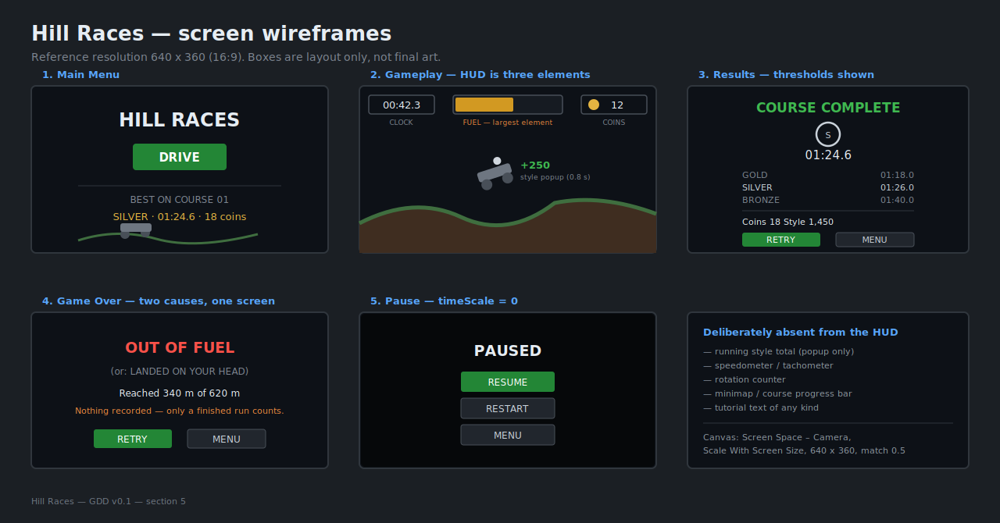
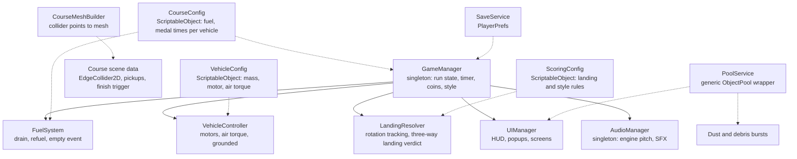

# Game Design Document -

_Hill Races_

|                                        |                                                                          |
| -------------------------------------- | ------------------------------------------------------------------------ |
| **Working title**                      | Hill Races                                                               |
| **Team**                               | Kobi Sima (solo - design, programming, integration)                      |
| **Genre**                              | Arcade / physics-driven side-scrolling hill climber / time-attack course |
| **Target platform**                    | PC (Windows) standalone + WebGL                                          |
| **Engine / Unity version**             | Unity 6 (6000.3.20f1), URP, 2D                                           |
| **Orientation & reference resolution** | Landscape, 640 × 360 reference (16:9)                                    |
| **Expected session length**            | 30 seconds - 4 minutes                                                   |
| **Document version**                   | v0.2 - 2026-09-25                                                        |

---

## 1. High Concept

A two-wheeled buggy crosses a hand-built course to a finish line under full physics. One axis of input: throttle and brake on the ground, rotation in the air. Fuel is short by design, and the cans that close the gap sit off the safe line. Land on the driver's head and the run ends. Finish time earns a medal. coins are the score.

### Design pillars

1. **Style is the resource** -
   Fuel in a course is tuned to fall short of a cautious run. The cans that close the gap are placed where a cautious driver cannot reach them: on the far side of a gap, above a ramp, at the bottom of a detour. Finishing without ever taking a risk is not meant to be possible. _This rules out: fuel cans on the safe line, enough fuel to finish without detours, passive fuel regeneration, and a "limp home" mode at zero._
2. **One input, two meanings -
   and that is the whole skill ceiling** -
   the same button is throttle on the ground and rotation in the air. Mastery is knowing which context you are in and how long you will stay there. _This rules out: dedicated rotation buttons, auto-levelling in air, landing assists, and any tutorial that explains the split. The player learns it by flipping the buggy once._
3. **Every metre is placed on purpose** -
   there is no terrain generator. The course is hand-built, and every jump, fuel can, and coin sits where it was put. _This rules out: procedural or randomised terrain, randomised pickup placement, hazards that spawn off-screen, obstacles that pop in, and difficulty that scales with distance instead of with the course._

---

## 2. Reference & Inspiration

- **Primary reference:** _Hill Climb Racing_ (Fingersoft, 2012). **Taking:** the two-wheeled physics vehicle driven by wheel motors, the input split between ground throttle and air rotation, fuel as the pressure on every run, the head-touches-ground failure condition, and coins strewn along the terrain. **Not taking:** the endless procedural hills, the vehicle roster, the stage and biome selection, the free-to-play upgrade economy, and the split-screen touch input layout.
- **Secondary reference:** _Trials_ (RedLynx). **Taking:** a hand-built course with a finish line, a clock, and medal thresholds that turn a single track into something you replay to improve. **Not taking:** the checkpoint-and-restart flow and the rider ragdoll.
- **Deliberate difference:** the original is an endless run that can only end in failure, and its meta-loop is coins → upgrades → further distance. This is a hand-built course with a finish line, so a run can be won. Coins are the score rather than a currency, fuel cans sit off the safe line so that reaching them costs risk, and finish time earns a medal -
  which makes one course worth replaying for two separate reasons.
- **Video:** [Hill Climb Racing gameplay](https://www.youtube.com/watch?v=fg9smFUXJBA) -
  shows the air rotation, the head-first landing that ends a run, and the fuel gauge draining between cans.

---

## 3. Core Game Loop

**Moment-to-moment rules** -
the things that are true every frame:

- The buggy is a `Rigidbody2D` body with two wheel bodies attached by `WheelJoint2D`. **Nothing in the game moves the buggy by setting position or velocity.** All motion comes from wheel motors and gravity -
  this is the rule that makes the terrain matter at all.
- `isGrounded` is true when either wheel is in contact with the `Ground` layer, sampled in `FixedUpdate`.
- **Grounded:** throttle drives the wheel motors toward `+maxMotorSpeed` at `motorRampRate`. brake drives them toward `−maxMotorSpeed * reverseFraction`. Releasing both sets `motorSpeed` to 0 and the buggy rolls freely -
  it does not actively stop.
- **Airborne:** the same two inputs instead apply `AddTorque` to the body at `airTorque` -
  throttle rotates the nose up, brake rotates it down. Wheel motors are disabled in air so the buggy does not land with its wheels spinning at full speed.
- **Fuel** drains at `fuelDrainIdle` always, plus `fuelDrainThrottle` while the throttle is held, so driving flat out costs roughly double. A can restores `fuelPerCan`, capped at `fuelCapacity` -
  overfilling is wasted, so reaching a can early is a real loss. Fuel is never granted by anything other than a can.
- **Rotation tracking:** while airborne the game accumulates signed body rotation. A **full rotation** is 360° of accumulated rotation in a single airborne period, in either direction. Partial rotation pays nothing.
- **Landing resolution** -
  evaluated on the first frame the buggy regains ground contact, in this order:
  1. If the `DriverHead` collider is touching the `Ground` layer → **crash**. This is checked first and overrides everything below, so a flip that lands head-first is fatal regardless of how many rotations it completed.
  2. Otherwise, if **both** wheels are in contact within `landingWindow` of each other, **and** the body's up vector is within `cleanLandingAngle` of the surface normal → **clean landing**. Style points for the airborne period are awarded: `points = fullRotations * rotationPoints + floor(airTime * airTimePoints)`.
  3. Otherwise → **sloppy landing**. No points are awarded. The run continues. This covers one-wheel touchdowns, side impacts, and landings that completed 360° but arrived at a steep angle.
- Because rule 2 measures the body's **current** angle rather than its net rotation, a buggy that completes exactly 360° and lands level is a clean landing and pays in full -
  the rotation count and the landing angle are independent tests.
- **Coins** are collected on trigger contact and are the score. They are placed on lines that compete with the fuel line, so taking coins is a decision, not a pickup.
- **Failure -
  two ways.** (a) The `DriverHead` collider touches the `Ground` layer: immediate crash. (b) Fuel reaches 0: the engine cuts, input is disabled, and the buggy coasts on momentum until it comes to rest or lands on its head. The coast-out exists so the player watches the consequence of a fuel decision made twenty seconds earlier.
- **Winning:** crossing the finish trigger ends the course. The results screen shows finish time, the medal earned against `goldTime` / `silverTime` / `bronzeTime`, coins collected, and style points.
- After a crash: a 1.5 s sequence (Cinemachine impulse shake, dust burst, engine-die sound), then the game-over screen. **Coins and style points from a failed run are discarded** -
  only a finished run records anything.

### Parameters you will need to tune

| Parameter                                              | What it controls                                                                                                                                                     | Value                                  |
| ------------------------------------------------------ | -------------------------------------------------------------------------------------------------------------------------------------------------------------------- | -------------------------------------- |
| `bodyMass` / `wheelMass`                               | The buggy's inertia - the ratio decides whether it feels like a vehicle or a shopping trolley                                                                        | 120 / 15                               |
| `centerOfMassOffset`                                   | **The single most important number in the project.** How easily the buggy wheelies and flips. Low and forward = stable and dull. high and back = flips on every bump | (0, −0.30)                             |
| `maxMotorSpeed`                                        | Wheel angular speed cap in °/s - with a 0.35 u wheel, 1600 °/s ≈ 10 u/s ground speed                                                                                 | 1600 °/s                               |
| `motorTorque`                                          | Whether the buggy can climb a steep face or just spins its wheels                                                                                                    | 800                                    |
| `motorRampRate`                                        | How committed throttle feels off the line                                                                                                                            | 2500 °/s²                              |
| `reverseFraction`                                      | How much of full power reverse gets - low enough that backing up is a correction, not a strategy                                                                     | 0.5                                    |
| `airTorque`                                            | Rotation speed in air - trades against air time. Too high and every jump becomes a flip                                                                              | 220                                    |
| `suspensionFrequency` / `dampingRatio`                 | Ride softness. Soft absorbs bumps and gives a visible bounce on landing but lets the wheels ride up into the body. stiff turns every rock into a flip                | **3.4 Hz / 0.5** (tuned; was 4.0 / 0.7) |
| `fuelCapacity` / `fuelDrainIdle` / `fuelDrainThrottle` | The run clock. Tuned per course so a cautious line runs dry before the finish                                                                                        | 100 / 2.0 /s / 2.0 /s                  |
| `fuelPerCan`                                           | How much one risky detour is worth - the main fairness dial on pillar 1                                                                                              | 35                                     |
| `cleanLandingAngle`                                    | How forgiving a landing is. The difference between a fair game and a cruel one                                                                                       | 40°                                    |
| `landingWindow`                                        | How close in time both wheels must touch to count as level                                                                                                           | 0.12 s                                 |
| `rotationPoints` / `airTimePoints`                     | Whether flips are worth attempting at all, against the fuel they cost                                                                                                | 250 / 40 per s                         |
| `goldTime` / `silverTime` / `bronzeTime`               | Medal thresholds, set per course after the course is playable - never guessed in advance                                                                             | -                                      |

Values in bold have been tuned in play. the rest are still first guesses.

**Where these live:** three ScriptableObject assets, split along the axes that vary independently -
`VehicleConfig` (mass, centre of mass, motor and air torque), `CourseConfig` (one course's fuel capacity and medal times), and `ScoringConfig` (landing angle window, rotation and air-time point values). No gameplay number is a literal in a script, and no tuning pass requires a recompile.

**Feel target:** a first-time player finishes the course within five attempts, and runs out of fuel on at least one of them. A player who has spent ten minutes on it takes at least one fuel can off the safe line and earns silver. If a first-timer flips the buggy within the first 50 metres, `centerOfMassOffset` is wrong.

---

## 4. Controls & Input

| Action                                              | Keyboard / Mouse        | Gamepad         | Touch                  |
| --------------------------------------------------- | ----------------------- | --------------- | ---------------------- |
| Throttle (ground) / rotate nose up (air)            | `D` / `→` / Right mouse | RT or South (A) | Right half of screen   |
| Brake and reverse (ground) / rotate nose down (air) | `A` / `←` / Left mouse  | LT or West (X)  | Left half of screen    |
| Restart course                                      | `R`                     | North (Y)       | On-screen restart icon |
| Pause                                               | `Esc`                   | Start           | On-screen pause icon   |

There are **only two gameplay inputs**, and they are the same two in both contexts. This is a design commitment rather than a simplification -
pillar 2 depends on one button meaning two things, so a third gameplay input would break it.

- Input is read on **press and hold** in `Update`, cached into a struct, and applied in `FixedUpdate`. No physics step ever sees stale input, and no press is dropped between steps.
- **Holding both inputs** resolves to brake on the ground and nose-down in the air. One rule, stated here so it is not decided by accident in code.
- Input is ignored when `EventSystem.current.IsPointerOverGameObject()` is true, so tapping a UI button never also opens the throttle. All non-interactive HUD Images have **Raycast Target disabled**.
- The results and game-over screens have a **1.0 s input lockout**, so the throttle being held at the moment of the crash cannot also dismiss the screen.
- `R` restarts the course immediately from anywhere during play, with no confirmation. A course is short and a run is often lost the moment a landing goes wrong. making the player watch the coast-out or walk a menu to try again would cost more than it protects.
- On focus loss the game auto-pauses (`OnApplicationFocus`). WebGL drops held-key state silently, so without this the buggy would coast to a stop unattended and burn fuel.

---

## 5. Screens & UI

1. **Main Menu** -
   title "HILL RACES", a `DRIVE` button, and the best result for the course: medal earned, best time, and best coin count. The buggy idles on the course terrain behind the menu.
2. **Gameplay** -
   the HUD below, and nothing else.
3. **Style popup** -
   transient, above the buggy on a clean landing: `+250` with a small flip icon. Fades over 0.8 s. A sloppy landing shows nothing at all -
   silence is the feedback, and it reads instantly against the popup the player expected.
4. **Results (course finished)** -
   finish time, medal earned, the three medal thresholds so the next target is visible, coins collected, style points, and totals against the previous best. Buttons `RETRY` and `MENU`.
5. **Game Over (crashed or out of fuel)** -
   which of the two ended the run, distance reached along the course, and a line stating that nothing was recorded. Buttons `RETRY` and `MENU`.
6. **Pause** -
   dimmed overlay, `RESUME` / `RESTART` / `MENU`, `Time.timeScale = 0`.

- **HUD during play:** three elements only.
  - **Fuel gauge**, top-centre -
    a horizontal bar, amber below 30%, red below 15%. The largest element on screen, because it is the only one that can end the run.
  - **Clock**, top-left -
    elapsed time, running. Small and monospaced.
  - **Coins**, top-right -
    count only.
- **Style points are deliberately not on the HUD.** They appear as the popup on landing and are totalled on the results screen. Putting a running style total on screen would compete with the fuel gauge for the player's attention during exactly the moments -
  mid-air, mid-landing -
  when they should be watching the buggy.
- **Also deliberately absent:** a speedometer, a tachometer, a rotation counter, a minimap, a progress bar along the course, and any tutorial text. The course is short enough to hold in the head, and the fuel gauge is the only thing that needs watching.
- **Canvas setup:** Screen Space - Camera, CanvasScaler _Scale With Screen Size_, reference 640 × 360, match = 0.5. TextMeshPro throughout. the clock and coin counter are centre-aligned with top-anchored RectTransforms so a digit-count change never shifts them sideways.

---

## 6. Art & Audio

"LucyLavend pack" below is the _Physics Car Game Asset Pack_ by LucyLavend.

| Asset                   | Variants / frames                                                     | Source                                              | Use                                                                    |
| ----------------------- | --------------------------------------------------------------------- | --------------------------------------------------- | ---------------------------------------------------------------------- |
| Buggy body              | 1 side-view chassis, 2 colours (`RedCar` in use)                      | LucyLavend pack                                     | `Rigidbody2D` body                                                     |
| Wheels                  | 2 identical (`Wheel`)                                                 | LucyLavend pack                                     | Separate transforms, rotated by physics, drawn behind the body         |
| Driver                  | 1 seated figure with a distinct head (`Body2` + `Head2`)              | LucyLavend pack                                     | Visual. the head carries the failure collider                          |
| Fuel can                | 1                                                                     | LucyLavend pack                                     | Pickup, pooled                                                         |
| Coin                    | 4 values (5 / 10 / 25 / 50), static                                   | LucyLavend pack                                     | Pickup, pooled                                                         |
| Low-fuel icon           | 1 (`Alarm`)                                                           | LucyLavend pack                                     | HUD low-fuel pulse                                                     |
| Finish gate             | 1                                                                     | TBD - CC0 1.0                                       | Marks the finish trigger                                               |
| Terrain - dirt fill     | 1 tiling texture (`DirtBG`)                                           | LucyLavend pack                                     | Body of the course mesh                                                |
| Terrain - grass edge    | 1 tiling strip (`Grass`)                                              | LucyLavend pack                                     | Top edge of the course mesh                                            |
| Parallax layers         | 3 (sky + clouds from the pack, far ridge, near hills)                 | LucyLavend pack (`SceneBG`, `Clouds`) + TBD - CC0 1.0 | Backdrop                                                             |
| Dust / debris particles | 2 systems                                                             | TBD - CC0 1.0                                       | Wheel dust, crash burst                                                |
| SFX                     | engine loop, coin, fuel pickup / landing, crash, engine-die, finish   | LucyLavend pack / TBD - CC0 1.0                     | -                                                                      |
| Music                   | 1 looping track                                                       | TBD - CC0 1.0                                       | Menu and gameplay                                                      |

> Assets not covered by the LucyLavend pack are chosen during production from Kenney, OpenGameArt, or itch.io, **provided each is CC0 1.0**, and are recorded in `Docs/CREDITS.md` as they are picked.

**Licence note:** the vehicle, driver, pickup and terrain sprites, plus the engine, coin and fuel SFX, come from LucyLavend's _Physics Car Game Asset Pack_ (free for personal and commercial use. resale and redistribution of the assets on their own are not permitted), used in this course project with the lecturer's approval. `Head.png` from that pack is the Godot engine logo and is deliberately not used. Every other asset in the build must be **CC0 1.0 Universal**: an asset is only used if its source page states CC0 explicitly - on itch.io, the check is the **Asset licence** field in the page's info table. a pack that is free to download but states no licence at all is treated as all rights reserved and is not used. Every source is listed in `Docs/CREDITS.md`. Asset packs advertised as containing the original _Hill Climb Racing_ game files were specifically rejected: a third-party re-upload of a commercial game's assets carries no licence the uploader had standing to grant, and this repository is public.

**Terrain rendering:** the course is authored as `EdgeCollider2D` points directly in the scene, using Unity's built-in collider point editor. At load, `CourseMeshBuilder` reads those points and interpolates them into a smooth curve. The mesh is built in two pieces from the same point list: a **grass strip** of fixed thickness following the curve, and a **dirt fill** skirted from just below it down to a fixed floor y. Both take UVs derived from world x so the textures tile continuously with no visible seams, and the strip is drawn on a sorting order above the fill. Both source textures must tile horizontally and be imported with `Wrap Mode: Repeat`. The collider is the source of truth for both physics and visuals -
there is no second copy of the course to keep in sync.

**Technical art rules:** bilinear filtering, no compression, PPU set per sprite so that the wheel radius is 0.35 u and the wheels sit in the body's wheel arches (`RedCar` 160, `Wheel` 183, `Body2` 160, `Head2` 400), a single Sprite Atlas (**V1 - V2 has known particle-system issues in Unity 6**), particle material `Legacy Shaders/Particles/Alpha Blended`. Sorting layers back→front: `Sky` → `ParallaxFar` → `ParallaxNear` → `TerrainFill` → `TerrainEdge` → `Pickups` → `Vehicle` → `VFX` → `UI`. Inside `Vehicle`, the order is driver (−2) → wheels (−1) → body (0), so that on a hard landing the wheels ride up _behind_ the body into the arches instead of being drawn over it.

**Engine audio:** one looping `AudioSource` whose `pitch` is driven from wheel angular velocity, clamped to a sane range. This is the cheapest single thing that makes a physics vehicle feel alive, and it is about six lines of code.

---

## 7. Technical Design

**Scenes:** two -
`Menu.unity` and `Course01.unity`. Each course is its own scene, because the course _is_ scene data: the `EdgeCollider2D` points, the pickup placements, and the finish trigger are all authored in the scene rather than loaded from a file. Retry reloads the active course scene.

**Packages / systems used:** Input System, Physics2D (`WheelJoint2D`, `EdgeCollider2D`), URP 2D Renderer, Cinemachine 3, TextMeshPro, `UnityEngine.Pool`.

**Target device:** Windows desktop (the development machine), plus a WebGL build verified in Chrome.

**Course authoring -
the workflow, not a system.** There is no terrain generator and no runtime terrain code beyond mesh construction. A course is built by dragging `EdgeCollider2D` points in the scene view, then placing fuel cans, coins, and the finish trigger by hand. `CourseMeshBuilder` runs once on `Awake`, reads the collider's points, and produces the two meshes described in section 6. This is the cheapest possible authoring pipeline: the level editor is Unity's own collider editor, and no custom tooling is written.

**Architecture:**

| Script              | Responsibility                                                                            |
| ------------------- | ----------------------------------------------------------------------------------------- |
| `GameManager`       | Owns the run state machine, the course timer, and the authoritative coin and style totals |
| `VehicleController` | Applies the two inputs as motor drive on the ground and body torque in the air            |
| `FuelSystem`        | Drains and refills fuel. raises the empty event that starts the coast-out                 |
| `LandingResolver`   | Tracks airborne rotation and returns the three-way landing verdict from section 3         |
| `CrashDetector`     | Watches the driver-head collider and raises the crash event                               |
| `CourseMeshBuilder` | Turns the authored collider points into the grass strip and dirt fill meshes              |
| `Pickup`            | One pooled coin or fuel can. reports collection and returns itself                        |
| `FinishTrigger`     | Detects the vehicle crossing the line and ends the course                                 |
| `ParallaxLayer`     | Scrolls one background layer at its own fraction of camera movement                       |
| `UIManager`         | Binds HUD widgets to `GameManager` events. owns the popup coroutines                      |
| `AudioManager`      | Singleton SFX and music playback, and engine pitch mapping                                |
| `PoolService`       | Generic wrapper over `UnityEngine.Pool.ObjectPool<T>` using create/get/release callbacks  |
| `SaveService`       | Reads and writes best time, best medal, and best coin count per course and vehicle        |
| `VehicleConfig`     | ScriptableObject: one vehicle's mass, centre of mass, motor and air-torque values         |
| `CourseConfig`      | ScriptableObject: one course's fuel capacity and its medal times, per vehicle             |
| `ScoringConfig`     | ScriptableObject: landing angle window, rotation and air-time point values                |

### The course features you are implementing

1. **Object Pool** (`PoolService`, extending Unity's `ObjectPool<T>` with generics and callbacks, as in session 6) -
   dust puffs, crash debris, and style popups. Dust is the case that makes this necessary rather than decorative: a puff is emitted at each wheel on every ground contact, and on a bumpy course that is dozens of short-lived objects per second, sustained for the whole run. Instantiating and destroying them at that rate produces GC spikes, and a dropped frame while the wheels are resolving contact with a slope can throw the vehicle into a rotation the player did not ask for -
   which would break pillar 3 directly, since the death would be the engine's fault rather than the course's. Pools are pre-warmed on `Awake` with every instance deactivated, sized above the initial count, and allowed to grow.
2. **Singleton** (`GameManager`, `AudioManager`) -
   guarded on `Awake` against duplicates and marked `DontDestroyOnLoad`. Retry reloads the course scene, so the run state and the looping engine audio both need an owner that survives the reload. without it the engine loop restarts on every attempt, which on a course the player retries fifty times is the difference between atmosphere and irritation.
3. **Coroutines** (session 5) -
   the crash sequence (disable input → impulse shake → dust burst → wait → game over screen), the fuel-empty coast-out, the style popup fade, and the low-fuel gauge pulse. Each is a timed sequence with waits rather than per-frame logic. writing them as timer fields in `Update` would mean hand-rolling a state machine for something the language already expresses.
4. **ScriptableObject** -
   deliberately split three ways along the axes that vary independently. `VehicleConfig` is what a vehicle _is_. `CourseConfig` is what one course _asks of it_ -
   fuel capacity, and medal times keyed per vehicle, since the same course runs at very different speeds on a buggy and a bike. `ScoringConfig` is what a good landing _is worth_, and is global. The split is what makes the two polish items cheap: a second course is one new asset and one new scene, and a second vehicle is one new asset plus new medal entries, with neither touching the other's tuning.
5. **PlayerPrefs** (`SaveService`) -
   best time, best medal, and best coin count, keyed per course and vehicle, read on the menu and written only when beaten.
6. **Cinemachine 3** (session 8) -
   one `CinemachineCamera` following the vehicle with damping and a dead zone, orthographic size easing outward with speed so fast sections reveal more of the course ahead, plus a `CinemachineImpulseSource` on the body for landing and crash shake. No camera movement code is written by hand.
7. **WebGL build** (session 6), with the Windows standalone build as the primary deliverable.

---

## 8. Scope

### 8.1 MVP -

the game is not a game without these

- [ ] Two-wheeled `WheelJoint2D` buggy driven entirely by wheel motors and gravity
- [ ] Throttle and brake on the ground, body torque in the air, from the same two inputs
- [ ] One hand-authored course: `EdgeCollider2D` points, pickups placed by hand, finish trigger
- [ ] `CourseMeshBuilder` producing the grass strip and dirt fill from the collider points
- [ ] Fuel drain, fuel cans, refuel, and the coast-out at zero
- [ ] Driver-head crash detection and the crash sequence
- [ ] Three-way landing resolution: crash, sloppy, clean -
      with airborne rotation tracking
- [ ] Coins as score. style points awarded on clean landings
- [ ] Course timer, finish detection, and medal thresholds from `CourseConfig`
- [ ] HUD: fuel gauge, clock, coin count. style popup on landing
- [ ] Menu, results screen, game-over screen, pause, instant restart
- [ ] `VehicleConfig`, `CourseConfig`, and `ScoringConfig` driving every tunable number
- [ ] `PlayerPrefs` best time, best medal, best coin count

### 8.2 Polish -

if the MVP is done and playable

Ordered. Each item is only started once the one above it is finished.

- [ ] **A second vehicle -
      a Trials-style motorbike:** higher centre of mass, shorter wheelbase, sharper air rotation. Selected from the menu, sharing the MVP course. One new `VehicleConfig` plus a re-tune of that course's medal times. First in this list because it changes how the existing course plays, which is worth more than another course to drive the same way.
- [ ] Cinemachine speed-scaled zoom and landing/crash impulse
- [ ] Wheel dust scaling with wheel speed. crash debris burst
- [ ] Engine audio with pitch driven by wheel angular velocity
- [ ] 3-layer parallax backdrop
- [ ] Low-fuel gauge pulse and audio cue
- [ ] Driver tumble on crash
- [ ] **A second course,** harder, as a new scene plus a new `CourseConfig`. Note that by this point it costs two tunings, not one, because both vehicles need medal times on it.
- [ ] Android build using the two-half touch layout from section 4
- [ ] A minimal upgrade shop -
      **exactly four upgrades** (engine torque, suspension damping, tyre grip, fuel capacity), three levels each, priced in coins, persisted in `PlayerPrefs`. Requires re-tuning medal times per upgrade level, which is why it is last.

### 8.3 Explicitly out of scope -

we are **not** building these

- **Procedural or endless terrain.** The course is authored by hand, start to finish. This is the decision the whole project rests on: it trades an open-ended tuning problem for a bounded design problem, which is the only trade that fits the schedule.
- **More than two courses, and more than two vehicles.** Tuning cost is the product of the two, not the sum -
  a third of either is not an addition, it is another full tuning pass across everything that already exists.
- **A custom level editor, or courses stored as data files.** The level editor is Unity's built-in collider point editor, and a course lives in its scene.
- **Multiplayer, online leaderboards, ghost replays, or any network service.** Persistence is local `PlayerPrefs` only.
- **The upgrade economy beyond the four listed items** -
  no ads, no currency purchase, no daily rewards, no garage screen beyond a list of four buttons. If the shop is not finished it is cut entirely. it is in polish, not MVP.
- **Checkpoints within a course.** A run is one attempt end to end. Restart is instant precisely so checkpoints are not needed.
- **Destructible terrain, moving obstacles, weather, or day/night cycles.** The course is static.
- **iOS builds, gamepad rumble, and localisation.**

---

## Changelog

| Version | Date       | Change                                          |
| ------- | ---------- | ----------------------------------------------- |
| v0.1    | 2026-09-15 | Initial draft (Hill Climb Racing-based concept) |
| v0.2    | 2026-09-25 | Asset pack chosen (LucyLavend), licence note and art table updated, PPU rule and in-vehicle draw order set, suspension tuned to 3.4 Hz / 0.5, broken tables repaired |
