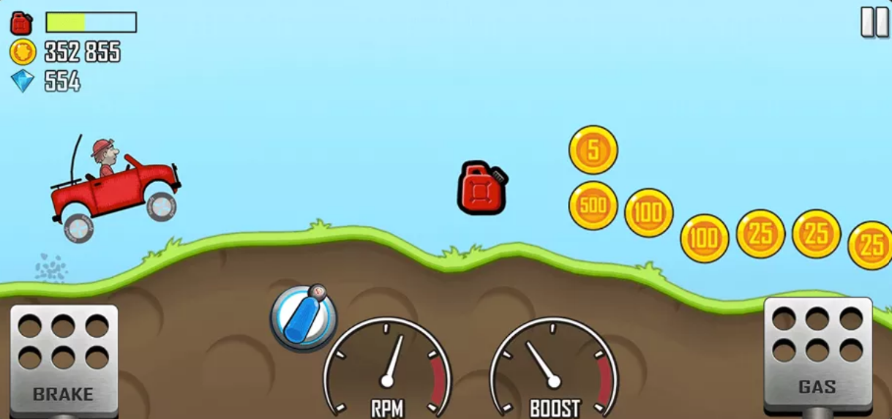
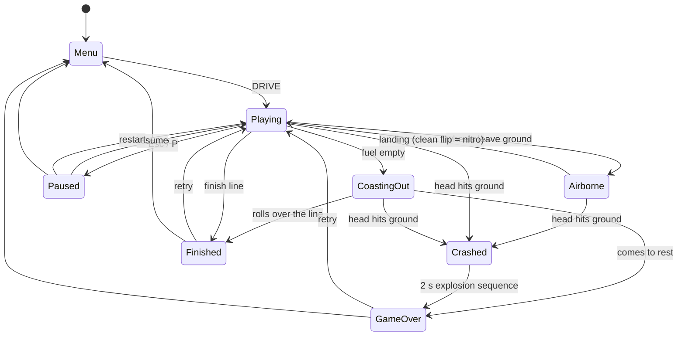
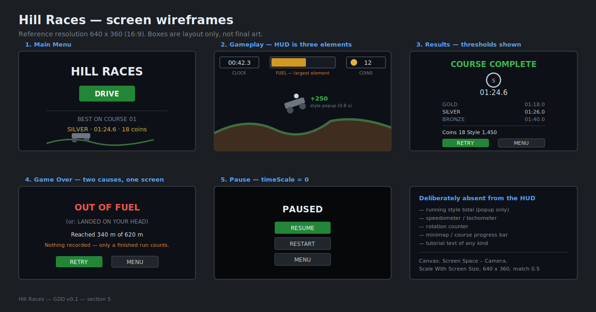
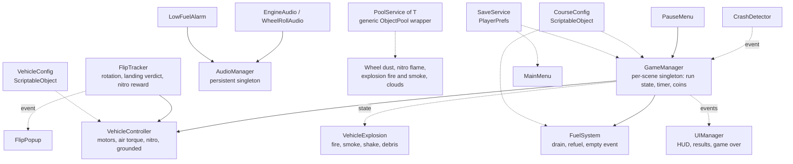

# Game Design Document

_Hill Races_

|                                        |                                                                          |
| -------------------------------------- | ------------------------------------------------------------------------ |
| **Working title**                      | Hill Races                                                               |
| **Team**                               | Kobi Sima (solo: design, programming, integration)                       |
| **Genre**                              | Arcade / physics-driven side-scrolling hill climber / time-attack course |
| **Target platform**                    | PC (Windows) standalone                                                  |
| **Engine / Unity version**             | Unity 6 (6000.3.20f1), URP, 2D                                           |
| **Orientation & reference resolution** | Landscape, 640 × 360 reference (16:9)                                    |
| **Expected session length**            | 30 seconds to 4 minutes                                                  |
| **Document version**                   | v0.5, 2026-10-04                                                         |

---

## 1. High Concept

A two-wheeled buggy crosses a hand-built course to a finish line under full physics. One axis of input: throttle and brake on the ground, rotation in the air. Fuel is short by design, and the cans that close the gap sit off the safe line. A flip landed cleanly on the wheels fires a burst of nitro. Land on the driver's head and the buggy explodes. Finish time earns a medal, coins are the score.

### Design pillars

1. **Style is the resource.** Fuel in a course is tuned to fall short of a cautious run, and the cans that close the gap are placed where a cautious driver cannot reach them: above a ramp, past a jump, at the bottom of a detour. Flips pay in nitro, and nitro pays in time. Finishing fast without ever taking a risk is not meant to be possible. _This rules out: fuel cans on the safe line, enough fuel to finish without detours, passive fuel regeneration, a "limp home" mode at zero, and nitro from anything other than a clean flip._
2. **One input, two meanings, and that is the whole skill ceiling.** The same button is throttle on the ground and rotation in the air. Mastery is knowing which context you are in and how long you will stay there. _This rules out: dedicated rotation buttons, a nitro button, auto-levelling in air, landing assists, and any tutorial that explains the split. The player learns it by flipping the buggy once._
3. **Every metre is placed on purpose.** There is no terrain generator. The course is hand-built, and every jump, fuel can, coin and log bridge sit where they were put. _This rules out: procedural or randomised terrain, randomised pickup placement, hazards that spawn off-screen, and difficulty that scales with distance instead of with the course._ (The clouds are the one random element, and they are pure decoration with no collider.)

---

## 2. Reference & Inspiration

- **Primary reference:** _Hill Climb Racing_ (Fingersoft, 2012). **Taking:** the two-wheeled physics vehicle driven by wheel motors, the input split between ground throttle and air rotation, fuel as the pressure on every run, the head-touches-ground failure condition, coins strewn along the terrain, the gas and brake pedals in the bottom corners and a needle gauge on the HUD. **Not taking:** the endless procedural hills, the vehicle roster, the stage and biome selection, the free-to-play upgrade economy, and touch input.
- **Secondary reference:** _Trials_ (RedLynx). **Taking:** a hand-built course with a finish line, a clock, and medal thresholds that turn a single track into something you replay to improve. **Not taking:** the checkpoint-and-restart flow and the rider ragdoll.
- **Deliberate difference:** the original is an endless run that can only end in failure, and its meta-loop is coins → upgrades → further distance. This is a hand-built course with a finish line, so a run can be won. Coins are the score rather than a currency, fuel cans sit off the safe line so that reaching them costs risk, a clean flip is rewarded with nitro, and finish time earns a medal, which makes one course worth replaying for two separate reasons.
- **Video:** [Hill Climb Racing gameplay](https://www.youtube.com/watch?v=fg9smFUXJBA) shows the air rotation, the head-first landing that ends a run, and the fuel gauge draining between cans.

---

## 3. Core Game Loop

```mermaid
stateDiagram-v2
    direction TB

    [*] --> Menu
    Menu --> Playing: DRIVE

    Playing --> Airborne: wheels leave ground
    Airborne --> Playing: landing (clean flip = nitro)
    Airborne --> Crashed: head hits ground
    Playing --> Crashed: head hits ground

    Playing --> Paused: Esc / P
    Paused --> Playing: resume

    Playing --> CoastingOut: fuel empty
    CoastingOut --> Crashed: head hits ground
    CoastingOut --> GameOver: comes to rest
    CoastingOut --> Finished: rolls over the line

    Playing --> Finished: finish line
    Crashed --> GameOver: 2 s explosion sequence

    Finished --> Playing: retry
    GameOver --> Playing: retry
    Paused --> Playing: restart
    Finished --> Menu
    GameOver --> Menu
    Paused --> Menu
```

**Moment-to-moment rules**, the things that are true every frame:

- The buggy is a `Rigidbody2D` body with two wheel bodies attached by `WheelJoint2D`. **Nothing in the game moves the buggy by setting position or velocity during a run.** All motion comes from wheel motors and gravity. This is the rule that makes the terrain matter at all. (The one exception is the explosion, which throws the wreck after the run is already over.)
- `IsGrounded` is true when either wheel touches the `Ground` layer, sampled in `FixedUpdate`. The log bridges are on the same layer, so to the buggy they are ground.
- **Grounded:** throttle drives the wheel motors toward `+maxMotorSpeed` at `motorRampRate`. Brake drives them toward `-maxMotorSpeed * reverseFraction`. Releasing both turns the motors off and the buggy rolls freely: it does not actively stop.
- **Airborne:** the same two inputs instead apply `AddTorque` to the body at `airTorque`: throttle rotates the nose up, brake rotates it down. Wheel motors are disabled in air so the buggy does not land with its wheels spinning at full speed.
- **Fuel** drains at `fuelDrainIdle` always, plus `fuelDrainThrottle` while the throttle is held. A can restores `fuelPerCan`, capped at `fuelCapacity`. Overfilling is wasted, so reaching a can early is a real loss. A can reached after the tank has run dry is ignored: the coast-out is final. Below `warningLevel` (15%) the fuel bar blinks and a beep sounds, faster as the tank empties.
- **Flip tracking:** the body's signed rotation is summed every physics step, on the ground as well as in the air, because a backflip usually starts as a wheelie before take-off. A jump is **judged only once the buggy has settled on both wheels for `settleTime`**, not at the first touch: a short bounce or a wheel scraping the ground mid-flip does not end the jump, and a landing that ends on the roof never settles.
- **Landing verdict**, in this order:
  1. The `DriverHead` collider touches the `Ground` layer → **crash**. Checked by its own trigger, so a flip that lands head-first is fatal however many rotations it completed.
  2. The jump lasted at least `minAirTime`, the total rotation is within `rotationTolerance` of a whole number of turns, and **the wheels touched the ground before the body did** → **clean flip**. A hard landing that bottoms out the suspension after the wheels are down still counts. The buggy gets `nitroPerFlip` seconds of nitro per flip, plus `comboBonus` for every extra flip in the same jump, and a popup names it: `BACKFLIP!`, `DOUBLE FRONTFLIP!`.
  3. Otherwise, if the buggy turned at least `minAttemptRotation` → **missed flip**, with a red popup: `LAME LANDING!` when the nose or tail hit first, `NOT GOOD ENOUGH!` when the rotation fell short. No reward.
- **Nitro:** while it burns, the motor's speed and torque are multiplied by `nitroSpeedMultiplier` and `nitroTorqueMultiplier`, and the buggy drives itself as if the throttle were held. Fire pours out of the exhaust, the engine screams above its normal pitch, and the gas pedal on the HUD stays pressed. Nitro from back-to-back landings adds up. It dies with the engine: out of fuel, crash or finish.
- **Coins** are collected on trigger contact and are the score. They are placed on lines that compete with the fuel line, so taking coins is a decision, not a pickup.
- **Failure, two ways.** (a) The `DriverHead` collider touches the `Ground` layer: the buggy explodes and the clock stops on that frame. A buggy that comes to rest upside down also counts as a crash once it has been tilted past `flippedAngle` and slower than `stuckSpeed` for `stuckDuration`, so the player is never left stuck. (b) Fuel reaches 0: the engine cuts, input is disabled, and the buggy coasts on momentum until it comes to rest or lands on its head. The coast-out adds `coastDrag` rolling resistance, and ends after `maxCoastDuration` at the latest.
- **The explosion:** a fireball and smoke from pooled puffs, a boom, a camera shake, the wheels torn off their joints and thrown, the body launched and spun, and the wreck left charred. It reacts to the GameManager entering the `Crashed` state rather than to the head trigger, so a buggy that tips over after crossing the finish line does not explode.
- **Winning:** crossing the finish trigger ends the course, including a buggy that rolls over the line on its momentum after running dry. The clock keeps running while it coasts. The results screen shows finish time, the medal earned against `goldTime` / `silverTime` / `bronzeTime`, coins collected, and the saved record.
- **Coins from a failed run are discarded**: only a finished run records anything.

### Parameters you will need to tune

| Parameter                                                       | What it controls                                                                                                   | Value                                                                              |
| --------------------------------------------------------------- | ------------------------------------------------------------------------------------------------------------------ | ---------------------------------------------------------------------------------- |
| `bodyMass` / `wheelMass`                                        | The buggy's inertia. The ratio decides whether it feels like a vehicle or a shopping trolley                       | 120 / 15                                                                           |
| `centerOfMassOffset`                                            | **The single most important number in the project.** How easily the buggy wheelies and flips                       | (0, -0.30)                                                                         |
| `maxMotorSpeed`                                                 | Wheel angular speed cap in °/s. With a 0.35 u wheel, 1700 °/s ≈ 10.4 u/s ground speed                              | **1700 °/s** (tuned, was 1600)                                                     |
| `motorTorque`                                                   | Whether the buggy can climb a steep face or just spins its wheels                                                  | **700** (tuned, was 800)                                                           |
| `motorRampRate`                                                 | How committed throttle feels off the line                                                                          | 2500 °/s²                                                                          |
| `reverseFraction`                                               | How much of full power reverse gets                                                                                | 0.5                                                                                |
| `airTorque`                                                     | Rotation speed in air. Too high and every jump becomes a flip                                                      | **600** (tuned, was 220)                                                           |
| `suspensionFrequency` / `dampingRatio`                          | Ride softness                                                                                                      | **3.4 Hz / 0.5** (tuned, was 4.0 / 0.7)                                            |
| `nitroSpeedMultiplier` / `nitroTorqueMultiplier`                | How hard nitro pushes. Too high and the buggy wheelies over on the first hill                                      | 1.5 / 1.3                                                                          |
| `fuelCapacity` / `fuelDrainIdle` / `fuelDrainThrottle`          | The run clock. Tuned per course so a cautious line runs dry before the finish                                      | **100 / 1.5 /s / 1.5 /s**                                                          |
| `fuelPerCan`                                                    | How much one risky detour is worth, and the main fairness dial on pillar 1                                         | 35                                                                                 |
| `warningLevel`                                                  | When the fuel bar starts to blink and beep                                                                         | **15%** (tuned, was 20%)                                                           |
| `minAirTime` / `settleTime`                                     | What counts as a jump, and how long the buggy must sit on both wheels before it is judged                          | 0.4 s / 0.2 s                                                                      |
| `rotationTolerance` / `minAttemptRotation`                      | How far from a whole turn still counts (take-off and landing slopes differ), and when a failed jump gets a message | **60°** / 180°                                                                     |
| `nitroPerFlip` / `comboBonus`                                   | Whether flips are worth attempting, against the fuel and risk they cost                                            | 1.5 s / 1 s                                                                        |
| `coastDrag` / `restSpeed` / `restDuration` / `maxCoastDuration` | How quickly the coast-out ends once the engine cuts                                                                | 1 / 0.3 u/s / 1 s / 8 s                                                            |
| `flippedAngle` / `stuckSpeed` / `stuckDuration`                 | When a buggy lying upside down counts as crashed                                                                   | 110° / 0.5 u/s / 1 s                                                               |
| `goldTime` / `silverTime` / `bronzeTime`                        | Medal thresholds, set per course after the course is playable, never guessed in advance                            | **55 / 65 / 80 s** (redesigned Course01, from playtests; a good run is about 62 s) |

Values in bold have been tuned in play, the rest are still first guesses.

**Where these live:** two ScriptableObject assets, split along the axes that vary independently: `VehicleConfig` (mass, centre of mass, suspension, motor, air torque and nitro) and `CourseConfig` (one course's fuel budget and medal times). The flip rules live on the `FlipTracker` component of the buggy prefab, the alarm level on the `LowFuelAlarm` component, all visible in the Inspector. No gameplay number is a literal in a script, and no tuning pass requires a recompile.

**Feel target:** a first-time player finishes the course within five attempts, and runs out of fuel on at least one of them. A player who has spent ten minutes on it lands a flip off a ramp on purpose, takes at least one fuel can off the safe line, and earns silver.

---

## 4. Controls & Input

| Action                                              | Keyboard    | Gamepad         |
| --------------------------------------------------- | ----------- | --------------- |
| Throttle (ground) / rotate nose up (air)            | `D` / `→`   | RT or South (A) |
| Brake and reverse (ground) / rotate nose down (air) | `A` / `←`   | LT or West (X)  |
| Restart course                                      | `R`         | North (Y)       |
| Pause                                               | `Esc` / `P` | Start           |

There are **only two gameplay inputs**, and they are the same two in both contexts. Nitro has no button: it is earned, not triggered. Pillar 2 depends on one button meaning two things, so a third gameplay input would break it.

- Input is polled through the Input System in `Update`, cached in fields, and applied in `FixedUpdate`. No physics step ever sees stale input.
- **Holding both inputs** resolves to brake on the ground and nose-down in the air.
- The results and game-over screens have a **1.0 s input lockout**, so the throttle held at the moment of the crash cannot also press `RETRY`.
- `R` restarts the course immediately from anywhere during play, with no confirmation.
- Menus work with the mouse and with a gamepad: each screen selects its first button when it opens.

---

## 5. Screens & UI

1. **Main Menu** (its own scene, build index 0): the course's grass and dirt with a parked buggy and drifting clouds behind the title "HILL RACES", the best result for the course read from `PlayerPrefs` (best time, best medal, most coins, or "NO RECORDS YET"), and `DRIVE` / `MUSIC: ON|OFF` / `QUIT` buttons. The music choice is saved, so it holds across sessions. `QUIT` hides itself in a WebGL build.
2. **Gameplay:** the HUD below.
3. **Flip popup:** under the top edge of the screen, pops in large, holds, then fades in a coroutine. Yellow for a clean flip (`DOUBLE BACKFLIP!` / `NITRO +4.0s`), red for a missed one (`LAME LANDING!` / `NOT GOOD ENOUGH!`). A new message restarts it.
4. **Results (course finished):** finish time, medal earned, coins collected, and one line against the saved record: `NEW BEST TIME!`, or the best time still standing. Buttons `RETRY` and `MENU`.
5. **Game Over (crashed or out of fuel):** which of the two ended the run (`CRASHED` / `OUT OF FUEL`), distance reached as a percentage of the way to the finish line, and a line stating that nothing was recorded. Buttons `RETRY` and `MENU`.
   On both end screens the buttons stay disabled for `endScreenInputLockout` (1 s).
6. **Pause:** `Esc` / `P` / Start. A dimmed overlay with `RESUME` / `RESTART` / `MENU`. `Time.timeScale = 0` stops physics, the clock and the fuel drain, and `AudioListener.pause` silences every sound, including the persistent AudioManager. Both are reset when the scene unloads, so a restart from the pause screen never starts frozen. Not available on the end screens.

- **HUD during play:**
  - **Top-left column**, each row an icon followed by its value: **fuel** (can icon and a bar in a thin white frame, green, amber below 30%, red below 15%, blinking below the warning level; the bar's width is driven from its right anchor so it is exactly proportional to the fuel left), **coins** (coin icon and count), **clock** (stopwatch icon, `m:ss.ff`).
  - **Bottom corners: brake and gas pedals**, as in the reference game. They press down and darken while their input is held, and the gas pedal also stays down while nitro burns.
  - **Bottom centre: a speedometer**, a needle gauge from 0 to 120 km/h that eases toward the buggy's real speed so bumps don't make it jitter. During nitro it climbs visibly past the normal top speed, which is the clearest way to show the reward working.
  - Values are bold white TextMeshPro, left-aligned, so a digit-count change only ever grows a value to the right.
- **Deliberately absent:** a tachometer, a rotation counter, a minimap, a progress bar along the course, and any tutorial text.
- **Canvas setup:** Screen Space - Overlay, CanvasScaler _Scale With Screen Size_, reference 640 × 360, match = 0.5, checked at 16:9 and 4:3.

---

## 6. Art & Audio

"LucyLavend pack" below is the _Physics Car Game Asset Pack_ by LucyLavend.

| Asset                       | Variants / frames                                                       | Source                                       | Use                                                                                         |
| --------------------------- | ----------------------------------------------------------------------- | -------------------------------------------- | ------------------------------------------------------------------------------------------- |
| Buggy body                  | 1 side-view chassis (`RedCar`)                                          | LucyLavend pack                              | `Rigidbody2D` body                                                                          |
| Wheels                      | 2 identical (`Wheel`)                                                   | LucyLavend pack                              | Separate bodies, drawn behind the body                                                      |
| Driver                      | 1 seated figure with a distinct head (`Body2` + `Head2`)                | LucyLavend pack                              | Visual. The head carries the failure collider                                               |
| Fuel can                    | 1                                                                       | LucyLavend pack                              | Pickup, placed by hand                                                                      |
| Coin                        | 3 values (5 / 10 / 50), prefabs `FiveCoin` / `TenCoin` / `FiftyCoin`    | LucyLavend pack                              | Pickup, placed by hand. 5 on the safe line, 10 on jump arcs, 50 only at the riskiest points |
| Terrain, dirt fill          | 1 tiling texture (`DirtBG`)                                             | LucyLavend pack                              | Body of the course mesh                                                                     |
| Terrain, grass edge         | 1 tiling strip (`Grass`)                                                | LucyLavend pack                              | Top edge of the course mesh                                                                 |
| Clouds                      | 3, sliced from one sheet (`Clouds`)                                     | LucyLavend pack                              | Pooled parallax clouds over a light blue sky                                                |
| HUD stopwatch icon          | 1                                                                       | Made for this project                        | HUD clock row                                                                               |
| Gas and brake pedals        | 2                                                                       | Made for this project                        | HUD bottom corners                                                                          |
| Speedometer dial and needle | 2                                                                       | Made for this project                        | HUD bottom centre                                                                           |
| Dust puff                   | 1 soft white round sprite, tinted per prefab                            | Made for this project                        | Wheel dust, nitro flame, explosion fire and smoke                                           |
| Log bridge                  | 1                                                                       | Made for this project                        | Bridges over the ravines                                                                    |
| Finish pole                 | 1                                                                       | LucyLavend pack                              | Marks the finish trigger                                                                    |
| Engine loop, coin, fuel     | 3                                                                       | LucyLavend pack                              | Engine pitch, pickups                                                                       |
| Gravel roll loop            | 1, edited into a seamless loop                                          | Pixabay ("Gravel Road", freesound_community) | Tyres on the dirt, louder and higher with speed                                             |
| Explosion                   | 1, trimmed to 3.5 s with a fade                                         | Mixkit ("Car explosion debris")              | The crash                                                                                   |
| Nitro activation            | 1, trimmed to 2.5 s with a fade                                         | Downloaded, source in `Docs/CREDITS.md`      | Plays once when the nitro kicks in                                                          |
| Low-fuel beep               | 1                                                                       | Made for this project                        | Fuel warning                                                                                |
| Music                       | 1 track ("Blues Country"), trailing silence trimmed so it loops cleanly | Pixabay (LiteSaturation)                     | Menu and gameplay, one continuous loop across scenes                                        |

**Licence note:** the vehicle, driver, pickup, terrain and cloud sprites, plus the engine, coin and fuel sounds, come from LucyLavend's _Physics Car Game Asset Pack_ (free for personal and commercial use; resale and redistribution of the assets on their own are not permitted), used in this course project with the lecturer's approval. `Head.png` from that pack is the Godot engine logo and is deliberately not used. The gravel loop and the music are under the Pixabay Content License and the explosion under the Mixkit Sound Effects Free License: both allow use inside a game without attribution, and both are credited anyway, as is the nitro activation sound. Everything marked "Made for this project" was drawn or synthesised for this game. Every source is listed in `Docs/CREDITS.md`. Asset packs advertised as containing the original _Hill Climb Racing_ files were specifically rejected: a re-upload of a commercial game's assets carries no licence the uploader could grant, and this repository is public.

**Terrain rendering:** the course is authored as `EdgeCollider2D` points directly in the scene, using Unity's built-in collider point editor. At load, `CourseMeshBuilder` interpolates those points into a smooth centripetal Catmull-Rom curve, writes the curve back into the collider so physics matches the visuals exactly, and builds two meshes from it: a **grass strip** of fixed thickness and a **dirt fill** down to a fixed floor. UVs follow distance along the surface (grass) and world position (dirt), so both textures tile with no seams. Each **log bridge** is a prefab: a sprite with a horizontal `CapsuleCollider2D` on the `Ground` layer; its rounded ends let the wheels roll on and off it smoothly.

**Background:** a light blue sky (the camera's background colour) and clouds. `CloudSpawner` places a few clouds across the view at the start and a new one past the right edge every few seconds, at a random height and size, taken from an object pool. Each `Cloud` follows the camera at 85% (parallax), so it reads as far away, drifts slowly with the wind, and returns to its pool once it leaves the view on the left.

**Technical art rules:** bilinear filtering, PPU set per sprite so that the wheel radius is 0.35 u and the wheels sit in the body's wheel arches (`RedCar` 160, `Wheel` 183, `Body2` 160, `Head2` 400). Sorting layers back to front: `TerrainFill` → `TerrainEdge` → default (vehicle, pickups, effects) → UI. Clouds are at order -20 so they stay behind everything. Inside the vehicle, the order is driver (-2) → wheels (-1) → body (0), so that on a hard landing the wheels ride up _behind_ the body.

**Audio:** one persistent `AudioManager` with four child sources, each on its own named object so they cannot be confused in the Inspector: **engine** (loop, pitch eased toward the wheel spin, plus a fixed boost during nitro), **roll** (gravel loop, always playing, its volume and pitch faded with ground speed and silenced in the air, so touching down never clicks), **effects** (one-shots: coin, fuel can, nitro, low-fuel beep, explosion, each with its own volume), and **music** (one loop that starts in the menu and plays on unbroken through every course and retry, because the manager is never reloaded). When a scene loads the effects source is stopped, so a long explosion never carries over into the next attempt. The menu's music toggle mutes the music rather than stopping it, so turning it back on continues the song.

---

## 7. Technical Design

**Scenes:** two, `Menu.unity` (build index 0) and `Course01.unity`. The course _is_ scene data: the `EdgeCollider2D` points, the log bridges, the pickup placements and the finish trigger are authored in the scene. Retry reloads the active scene. Scene names live in one place, `SceneLoader`.

**Packages / systems used:** Input System, Physics2D (`WheelJoint2D`, `EdgeCollider2D`), URP 2D Renderer, Cinemachine 3 (follow camera and impulse), TextMeshPro, `UnityEngine.Pool`.

**Target device:** Windows desktop standalone.

**Course authoring: the workflow, not a system.** A course is built by dragging `EdgeCollider2D` points in the scene view, then placing fuel cans, coins, the log bridges and the finish trigger by hand. `CourseMeshBuilder` runs once on `Awake`. The `Ground` object is scaled 1.8 to stretch the whole course; the collider and both meshes scale together, and every placement works in world space.

**Collision robustness:** the edge collider is a line with no thickness, so both wheels use **Continuous** collision detection and the edge collider has an `Edge Radius` of 0.05.

**Architecture:**

```mermaid
graph TD
    GM[GameManager<br/>per-scene singleton: run state, timer, coins] --> V[VehicleController<br/>motors, air torque, nitro, grounded]
    GM --> F[FuelSystem<br/>drain, refuel, empty event]
    FT[FlipTracker<br/>rotation, landing verdict, nitro reward] --> V
    FT -.event.-> FP[FlipPopup]
    CD[CrashDetector] -.event.-> GM
    GM -.state.-> VE[VehicleExplosion<br/>fire, smoke, shake, debris]
    GM -.events.-> UI[UIManager<br/>HUD, results, game over]
    PM[PauseMenu] --> GM
    AM[AudioManager<br/>persistent singleton]
    EA[EngineAudio / WheelRollAudio] --> AM
    LFA[LowFuelAlarm] --> AM
    POOL[PoolService of T<br/>generic ObjectPool wrapper] -.-> DUST[Wheel dust, nitro flame,<br/>explosion fire and smoke, clouds]
    VC[VehicleConfig<br/>ScriptableObject] -.-> V
    CC[CourseConfig<br/>ScriptableObject] -.-> F
    CC -.-> GM
    SAVE[SaveService<br/>PlayerPrefs] -.-> GM
    SAVE -.-> MM[MainMenu]
```

| Script                            | Responsibility                                                                                                         |
| --------------------------------- | ---------------------------------------------------------------------------------------------------------------------- |
| `GameManager`                     | Owns the run state machine, the course timer, the coast-out and crash coroutines, coins, and the finish record         |
| `VehicleController`               | Applies the two inputs as motor drive on the ground and body torque in the air; burns nitro                            |
| `FlipTracker`                     | Sums rotation, judges each jump once the buggy settles, rewards clean flips with nitro, reports missed ones            |
| `CrashDetector`                   | Watches the driver-head trigger and a buggy stuck upside down, and raises the crash event                              |
| `VehicleExplosion`                | On the `Crashed` state: pooled fire and smoke, boom, camera impulse, wheels torn off, body charred                     |
| `FuelSystem`                      | Drains and refills fuel, raises the empty event that starts the coast-out                                              |
| `CourseMeshBuilder`               | Turns the authored collider points into the grass strip and dirt fill meshes                                           |
| `Pickup`                          | One hand-placed coin or fuel can: reports collection, plays its sound, deactivates itself                              |
| `FinishTrigger`                   | Detects the vehicle crossing the line once and raises an event                                                         |
| `UIManager`                       | Binds the HUD and the two end screens to `GameManager` and `FuelSystem` events                                         |
| `FlipPopup`                       | Shows the flip or missed-flip message in a pop, hold and fade coroutine                                                |
| `Speedometer` / `PedalDisplay`    | The needle gauge and the two pedals on the HUD                                                                         |
| `LowFuelAlarm`                    | Blinks the fuel bar and beeps below the warning level, faster as the tank empties                                      |
| `PauseMenu`                       | Esc / P / Start pause, `timeScale` and audio pause, resume / restart / menu                                            |
| `MainMenu`                        | Shows the saved bests, starts the course, toggles the music, quits                                                     |
| `SceneLoader`                     | Static. The one place that knows the scene names                                                                       |
| `TimeFormatter`                   | Static. Formats a run time as `m:ss.ff` everywhere                                                                     |
| `AudioManager`                    | Persistent singleton: engine, roll, effect and music sources, and the music toggle                                     |
| `EngineAudio` / `WheelRollAudio`  | Feed the AudioManager the revs, the nitro state and the ground speed                                                   |
| `PoolService<T>`                  | Generic wrapper over `UnityEngine.Pool.ObjectPool<T>` with pre-warm, get and release                                   |
| `DustPuff`                        | One pooled puff: grows, drifts (with an optional launch velocity), fades or follows a colour gradient, releases itself |
| `WheelDustEmitter` / `NitroFlame` | Take puffs from a pool behind the grounded wheels and out of the exhaust                                               |
| `CloudSpawner` / `Cloud`          | Pooled parallax clouds                                                                                                 |
| `SaveService`                     | Static. Reads and writes best time, best medal and most coins per course, and the music setting                        |
| `VehicleConfig` / `CourseConfig`  | The two ScriptableObjects                                                                                              |

### The course features you are implementing

1. **Object Pool** (`PoolService<T>`, a generic wrapper over Unity's `ObjectPool<T>` with create, get and release callbacks, as in session 6). It is used in five places: wheel dust, the nitro flame, the explosion's fire and smoke, and the clouds. Dust is the case that makes it necessary rather than decorative: dozens of short-lived puffs per second, for the whole run. Instantiating and destroying them at that rate produces GC spikes, and a dropped frame while the wheels are resolving contact with a slope can throw the buggy into a rotation the player did not ask for. Pools are pre-warmed on `Awake`, so even the explosion's burst of thirty puffs costs no `Instantiate` on the frame of the crash. Coins and fuel cans are **not** pooled: they are placed by hand, collected at most once, and a retry reloads the scene anyway.
2. **Singleton** (`GameManager`, `AudioManager`): both guarded in `Awake` against duplicates, with a static `Instance`. They differ in lifetime, deliberately. `GameManager` is **per-scene**: it clears `Instance` in `OnDestroy`, and a retry brings a fresh one, since a persistent one would hold references to the previous scene's buggy. `AudioManager` is `DontDestroyOnLoad`, so there is one set of audio sources for the whole session. Because it outlives every scene, the components that drive it silence the engine and the roll in their own `OnDisable`, and it stops its effects source itself when a scene loads.
3. **Coroutines** (session 5): the coast-out, the crash sequence, the end-screen input lockout, and the flip popup's pop, hold and fade. Each is a timed sequence with waits, which a coroutine expresses directly instead of a hand-rolled timer state machine in `Update`.
4. **ScriptableObject:** `VehicleConfig` is what a vehicle _is_ (mass, suspension, motor, air torque, nitro). `CourseConfig` is what one course _asks of it_ (fuel budget and medal times). A second vehicle or a second course would each be one new asset, with neither touching the other's tuning.
5. **PlayerPrefs** (`SaveService`): best time, best medal, and most coins, keyed per course by scene name, written only when beaten and read by the main menu. Each best is compared on its own, so a slow run with many coins still keeps its coin record. The music on/off choice is saved the same way. `PlayerPrefs.Save()` is called straight away.
6. **Events** (C# `Action`), subscribed in `OnEnable` and removed in `OnDisable`: crash, finish, fuel changed and emptied, coins changed, run state changed, flip landed and flip missed. Nothing polls another object for something that is an event.
7. **Cinemachine 3** (session 8): one `CinemachineCamera` following the buggy, plus a `CinemachineImpulseSource` on the buggy and a `CinemachineImpulseListener` on the camera for the explosion shake. No camera code is written by hand.
8. **Windows standalone build.**

---

## 8. Scope

### 8.1 MVP

- [x] Two-wheeled `WheelJoint2D` buggy driven entirely by wheel motors and gravity
- [x] Throttle and brake on the ground, body torque in the air, from the same two inputs
- [x] One hand-authored course: `EdgeCollider2D` points, pickups placed by hand, finish trigger
- [x] `CourseMeshBuilder` producing the grass strip and dirt fill from the collider points
- [x] Fuel drain, fuel cans, refuel, and the coast-out at zero
- [x] Driver-head crash detection and the crash sequence
- [x] Flip tracking with a clean / missed / crash verdict
- [x] Coins as score
- [x] Course timer, finish detection, and medal thresholds from `CourseConfig`
- [x] HUD: fuel gauge, clock, coin count
- [x] Menu, results screen, game-over screen, pause, instant restart
- [x] `VehicleConfig` and `CourseConfig` driving the tunable numbers
- [x] `PlayerPrefs` best time, best medal, most coins

### 8.2 Polish

- [x] Nitro as the reward for a clean flip, with combos, popup, exhaust flame and engine sound
- [x] Explosion on crash: pooled fire and smoke, boom, camera impulse, flying wheels, charred wreck
- [x] Engine audio with pitch driven by wheel spin, gravel roll loop, pickup sounds
- [x] Pooled wheel dust
- [x] Low-fuel blinking bar and beep
- [x] Gas and brake pedals and a speedometer on the HUD
- [x] Light blue sky with pooled parallax clouds
- [x] Log bridges on the course
- [x] Looping background music with an on/off toggle in the menu, saved in `PlayerPrefs`
- [ ] A second vehicle (a Trials-style motorbike), sharing the course
- [ ] A second course, as a new scene plus a new `CourseConfig`
- [ ] Android build with on-screen pedals as touch buttons
- [ ] WebGL build
- [ ] A upgrade shop with exactly four upgrades

### 8.3 Explicitly out of scope

- **Procedural or endless terrain.** The course is authored by hand, start to finish.
- **More than two courses, and more than two vehicles.** Tuning cost is the product of the two, not the sum.
- **A custom level editor, or courses stored as data files.**
- **Multiplayer, online leaderboards, ghost replays, or any network service.** Persistence is local `PlayerPrefs` only.
- **An upgrade economy.** Coins are the score, not a currency.
- **Checkpoints within a course.** Restart is instant precisely so checkpoints are not needed.
- **Destructible terrain, moving obstacles, weather, or day/night cycles.**
- **iOS builds, gamepad rumble, and localisation.**

---

## Changelog

| Version | Date       | Change                                                                                                                                                                                                                                                                                                                                                                                                                                                                                                                                                                                                                                                                                                                                                                                                                                                                              |
| ------- | ---------- | ----------------------------------------------------------------------------------------------------------------------------------------------------------------------------------------------------------------------------------------------------------------------------------------------------------------------------------------------------------------------------------------------------------------------------------------------------------------------------------------------------------------------------------------------------------------------------------------------------------------------------------------------------------------------------------------------------------------------------------------------------------------------------------------------------------------------------------------------------------------------------------- |
| v0.1    | 2026-09-15 | Initial draft (Hill Climb Racing-based concept)                                                                                                                                                                                                                                                                                                                                                                                                                                                                                                                                                                                                                                                                                                                                                                                                                                     |
| v0.2    | 2026-09-25 | Asset pack chosen (LucyLavend), licence note and art table updated, PPU rule and in-vehicle draw order set, suspension tuned to 3.4 Hz / 0.5, broken tables repaired                                                                                                                                                                                                                                                                                                                                                                                                                                                                                                                                                                                                                                                                                                                |
| v0.3    | 2026-09-30 | Motor and air torque tuned. Fuel drain lowered to 1.5 / 1.5. Coast-out rolling drag and time limit added. Finishing while coasting allowed. GameManager made a per-scene singleton, AudioManager stays persistent. Pickups placed by hand, not pooled                                                                                                                                                                                                                                                                                                                                                                                                                                                                                                                                                                                                                               |
| v0.4    | 2026-10-02 | Medal times set from playtests. Crash also when stuck upside down. HUD redesigned as a top-left icon column. Results show the saved best. End-screen input lockout. Wheels use Continuous collision. Coins are 5 / 10 / 50. SaveService keyed per course                                                                                                                                                                                                                                                                                                                                                                                                                                                                                                                                                                                                                            |
| v0.5    | 2026-10-04 | Style points replaced by **nitro**: a clean flip (wheels land first, judged once the buggy settles) earns nitro, with combos and a popup for hits and misses. `ScoringConfig` and `LandingResolver` dropped; the flip rules live on `FlipTracker`. Crash became an **explosion** with pooled fire and smoke, camera impulse and flying wheels. Audio: persistent AudioManager with engine, gravel roll and effect sources, explosion and low-fuel beep. Pause menu, main menu scene, MENU buttons. HUD gained pedals, a speedometer and a blinking low-fuel bar (15%). Light blue sky with pooled parallax clouds. Course redesigned with log bridges, medal times re-set to 55 / 65 / 80 s. Looping music with a saved on/off toggle. Main menu shows the course terrain, a parked buggy and clouds. Target narrowed to Windows; WebGL, touch and mouse input moved out of the MVP |
