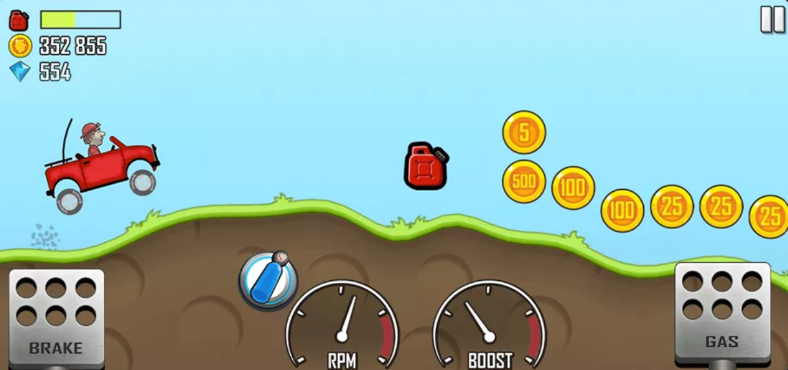

# Hill Races

A physics-driven hill racing game built in Unity 6 (URP, 2D). A two-wheeled buggy on a hand-built course with a finish line, one input that means throttle on the ground and rotation in the air, and a fuel tank tuned to fall short of a cautious run. This repository currently holds the Game Design Document, submitted for approval before implementation.

## Concept

## Screens

## Design document

The full GDD is in [`Docs/GDD.md`](Docs/GDD.md). It covers the high concept and design pillars, the core loop and tuning parameters, controls, screens, the art and audio plan, technical design, and scope.

## Planned build

- Engine: Unity 6 (6000.3.20f1), URP, 2D
- Platforms: Windows standalone and WebGL
- Orientation: Landscape, 640 x 360 reference
- Physics: `WheelJoint2D` drive over a hand-authored `EdgeCollider2D` course
- Course authoring: Unity's built-in collider point editor — no custom tooling, no terrain generator
- Course concepts: object pooling, singletons, coroutines, ScriptableObjects, PlayerPrefs, Cinemachine

## Assets

All third-party assets are CC0 1.0 Universal. Sources are listed in [`Docs/CREDITS.md`](Docs/CREDITS.md) as they are chosen.
